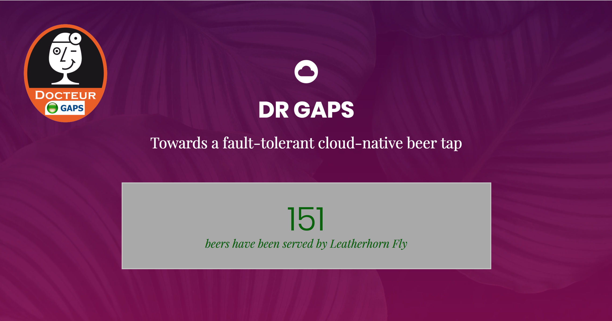

# DR GAPS: Towards a fault-tolerant cloud-native beer tap

A quick introduction to Docker and related tools.

## Objectives

The goal of this project is to demonstrate how Docker can be used to manage application services, making it easier to tackle non-functional requirements. 

## Architecture

The system consists of the following components:

* the core component is **a simple web application**, with a back-end and a front-end. The back-end serves HTML, JS and CSS assets to the client. It also exposes a simple REST API

* **Docker** is a technology that allows us to package application services in lightweight "virtual machines" called containers. In this example, our web application, Portainer and Traefik are all running in Docker containers.

* **Docker Compose** allows you to describe how multiple containers interact with each other to create a complete IT infrastructure.

* **Portainer** is an open source admin GUI for Docker. It provides a web UI to show which containers are running, etc. 

* **Traefik** is an open source reverse proxy / load balancer. We use it to distribute HTTP trafic between multiple HTTP server nodes.


## Experiment 1: run a fragile service locally

Assuming that you have installed [node.js](https://nodejs.org/en/download/) and [grunt](https://gruntjs.com/installing-grunt) on your machine, you can run the application locally:

```
cd dr-gaps-webapp
grunt
```

By default, the server will listen on port 3000. Fire up a browser and visit [http://localhost:3000/](http://localhost:3000). At this point, you should see the landing page, with a counter that keeps increasing. The name of the waiter is generated randomly when the server starts.



Now, go ahead and kill the server. Don't use any precaution, be brutal. The browser should turn to:


Typically, this is when your pager will ring in the middle of the night. You will have to get up, connect to the system and restart the server to bring it back to green. You can try that: the counter should resume (behind the scenes AJAX requests are sent from the browser to the REST API every second).

## Experiment 2: run a resilient service with Docker

Now that you have seen what the application service is supposed to do, let's build a runtime infrastructure that will allow us to sleep safely. To do this experiment, you need to install [Docker](https://docs.docker.com/install/) and [Docker Compose](https://docs.docker.com/compose/install/).

First, open a terminal and go to the infrastructure directory and ask Docker Compose to do its job:

```
cd infra
docker-compose up
```

Docker Compose is responsible to setup and bootstrap your virtualized IT infrastructure. To do that, the tool will parse the file ```docker-compose.yml```, which lists all the services that you have decided to use. In our case, we have 3 services:

* **DR GAPS**: our node.js application service. We will run multiple versions of this service (to demonstrate scalability and availability)
* **portainer**: an admin console that gives us visibility into our IT infrastructure
* **traefik**: a reverse proxy / load balancer that provides a "smart" entry point into our IT infrastructure. All requests go through traefik, which distributes them between the multiple DR GAPS nodes.

After typing the command, you will see that Docker downloads images from the Internet and builds a custom image (for DR GAPS). Docker then starts the services and prints the logs on the terminal.

Launch your favorite web browser and visit the following pages. The hostname in the URL will depend on your Docker installation (Docker for Linux/Windows/Mac vs Docker Machine):

* DR GAPS: [http://localhost/](http://localhost/) or [http://192.168.99.100/](http://192.168.99.100/)

* Portainer: [http://localhost/portainer/)](http://localhost/portainer/)) or [http://192.168.99.100/portainer/)](http://192.168.99.100/portainer/))

* Traefik: [http://localhost:8080/)](http://localhost:8080/)) or [http://192.168.99.100:8080/)](http://192.168.99.100:8080/))
 

Now is the time to have fun. Open a terminal, go into the ``ìnfra``` directory and use the following command:

```
docker-compose scale drgaps=0
```

This will kill the running DR GAPS container (because we tell Docker Compose that we want 0 instances of that service running). You can checkout the impact in the UI of the 3 services.

Now, tell Docker Compose to run 10 instances of DR GAPS. The infrastructure is elastic: everything will automatically adapt to this new setup. The browser will keep sending AJAX requests to Traefik. Trafik listens for GAPS containers that come and go, and is able to distribute requests among them. On the side, Portainer gives you a view of what is currently running.

```
docker-compose scale drgaps=10
```

Repeat and rinse. Play with the containers, analyze what is displayed in the UI. Try to kill the containers by various means.


